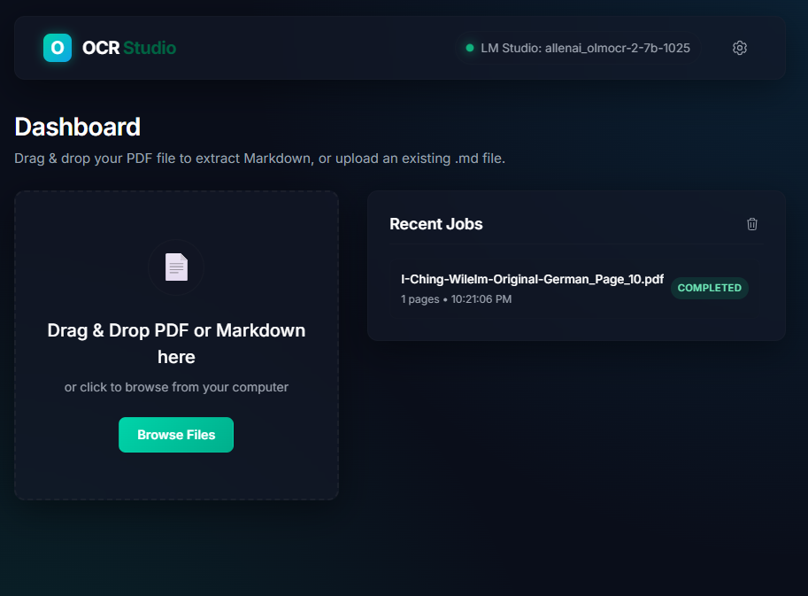
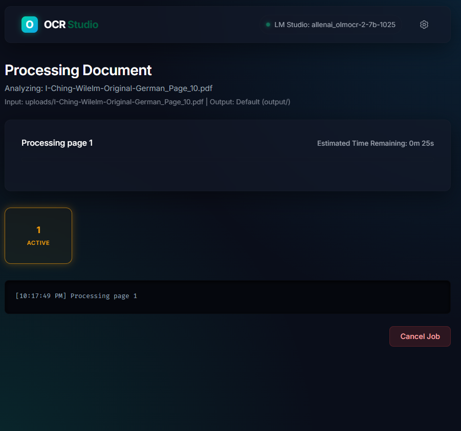
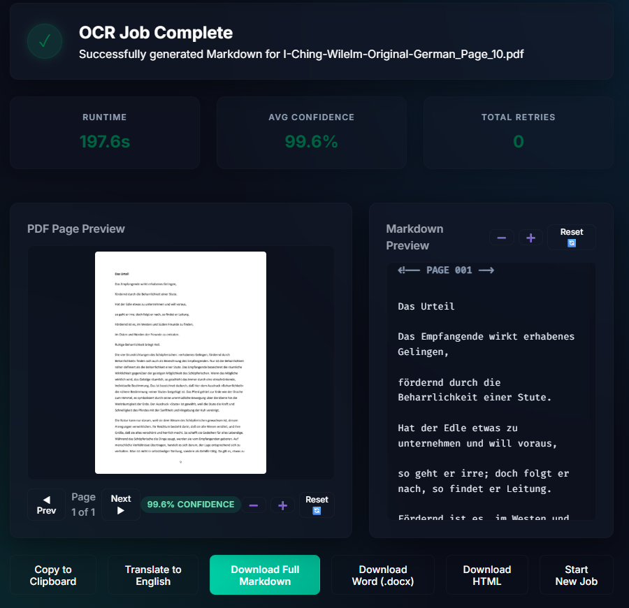
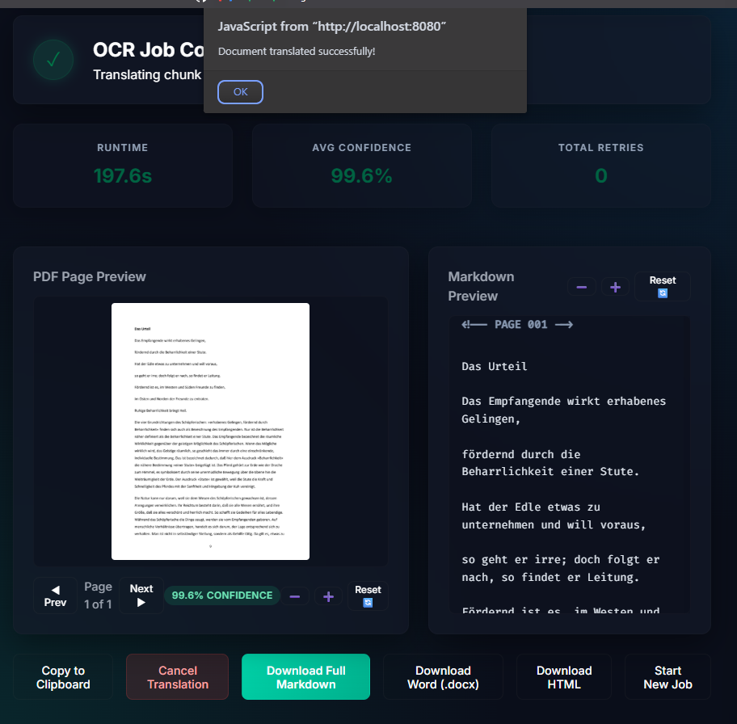
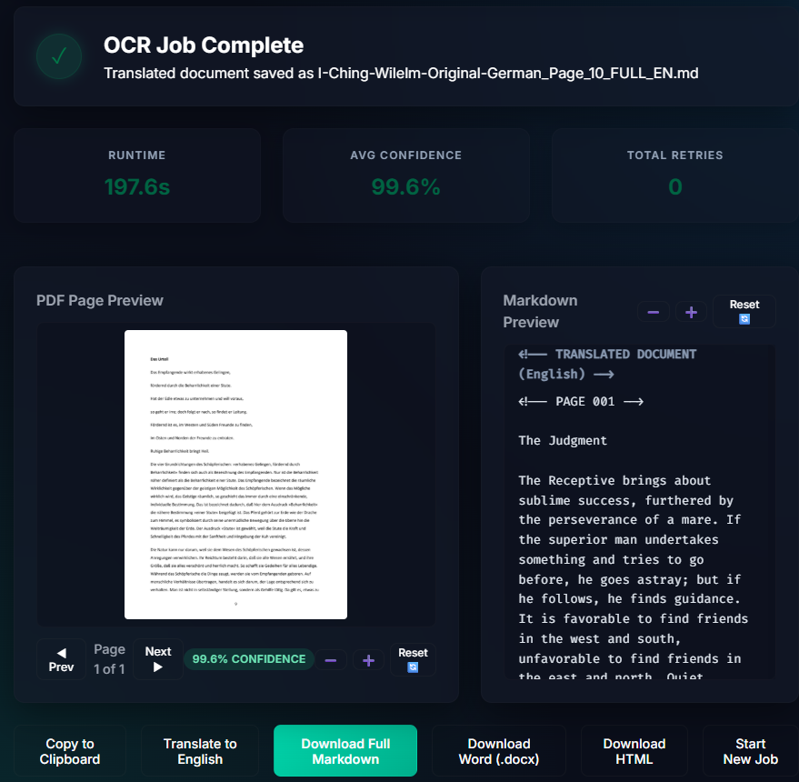
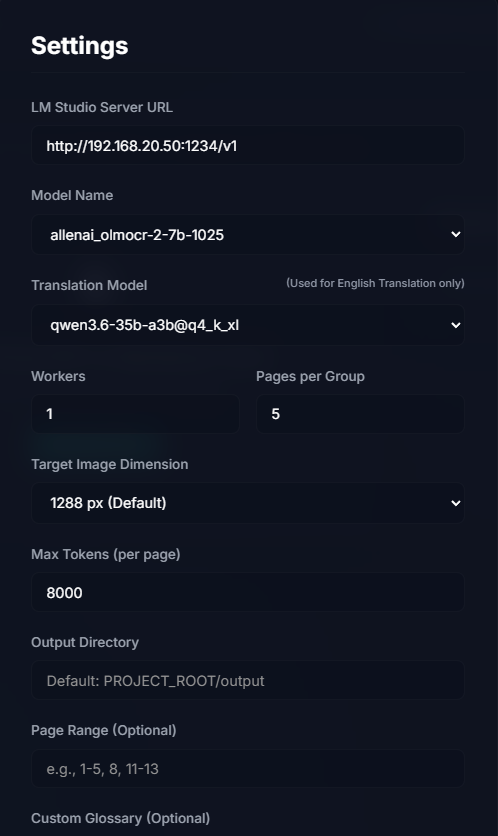
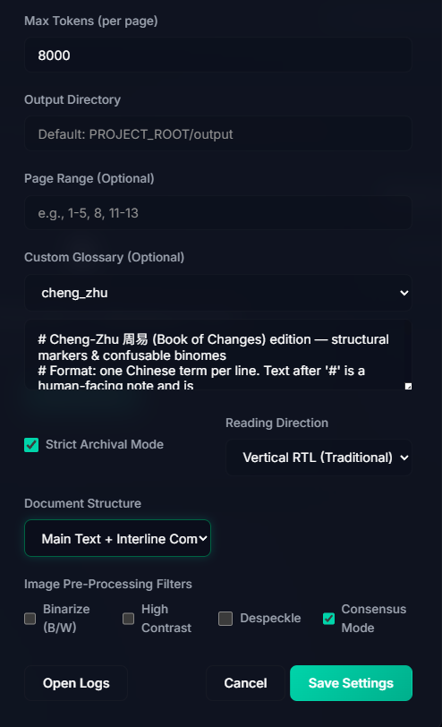

# OCR Studio

**OCR Studio** is a premium, **fully local, privacy-first** web GUI that wraps a vision‑language OCR pipeline (built around [OlmOCR](https://github.com/allenai/olmocr)) for digitizing difficult documents — especially **historical Chinese woodblock texts** (but fully compatible with **any language**, such as German OCR followed by translation to English). You launch a single script, a browser dashboard opens, and you can drag‑and‑drop PDFs (or sideload existing Markdown), watch real‑time page‑by‑page progress, interactively correct the results, translate source text to English, and export clean Markdown, HTML, or Word — all without touching the command line, and without any data ever leaving your machine or LAN.

All inference runs against a local **OpenAI‑compatible** server (e.g. [LM Studio](https://lmstudio.ai/)). There are no cloud calls, no telemetry, and no analytics.

## Screenshots

| **0. Dashboard** | **1. Processing OCR PDF** | **2. Processed Completed** |
| :---: | :---: | :---: |
|  |  |  |
| **3. Translation to English Completed** | **4. Translated English** | **5. Settings 1** |
|  |  |  |
| **6. Settings 2** | | |
|  | | |

---

## Key Features

### Core OCR pipeline

* **Drag‑and‑drop dashboard** — upload single or multiple PDFs through a glassmorphic dark‑mode UI. Multiple files are **queued and processed sequentially** by a background worker.

* **Markdown sideloading** — drop or browse an existing `.md` file to open it **directly** in the editor (bypassing OCR) for review, correction, export, or translation.

* **Real‑time progress & ETA** — live page‑by‑page status over WebSockets, with an estimate that learns from measured page speed.

* **Image pre‑processing** — clean noisy archival scans on the fly with Pillow filters: **Binarize**, **High Contrast**, **Despeckle**.

* **Self‑healing retries** — auto‑detects and corrects page **rotation**, **auto‑upscales** resolution for dense tables and small marginal annotations, and triggers **smart retries** at higher resolution when page confidence drops below 75%.

* **True Resumption** — an interrupted job resumes from the last cached page instead of re‑OCRing completed pages.

* **Page‑range selection** — OCR only a subset of pages (e.g. `1-10, 15, 40-`).

* **Universal language support** — although heavily optimized for historical Chinese woodblocks, the VLM pipeline works out-of-the-box with **any language**. Support for scripts like **Latin** and **Ancient Greek** is highly robust due to underlying model capabilities, while rare or pictographic scripts (such as **Egyptian Hieroglyphs**) are fully supported as long as a specialized fine-tuned local VLM is loaded in the inference server.

### Archival / CJK support

* **Reading direction** — **Vertical RTL** (traditional right‑to‑left columns), **Horizontal LTR**, or **Default**. Vertical RTL uses upright native prompts (no destructive rotation) and auto‑upscales to 2400px so small margin columns stay legible.

* **Document structure** — **Standard** or **Main Text + Interline Commentary** (preserves hierarchical `[commentary]` bracketing).

* **Strict Archival Mode** — instructs the model to transcribe faithfully without normalization or summarization.

* **Deterministic Correction Net** — a glossary of `BAD -> GOOD` pairs rewrites known vision‑encoder misreads *after* OCR (e.g. `木義 -> 本義`, `晝夜` corrections). This fixes glyph errors the model cannot self‑correct. Ships with a curated **Cheng‑Zhu / I Ching (周易傳義大全)** preset, every pair ground‑truthed against the source woodblock.

* **Glossary presets & custom terms** — load a shippable preset from the `glossaries/` folder or paste your own domain terms and correction pairs.

### Interactive QA editor (Human‑in‑the‑Loop)

* **Side‑by‑side preview** — the structured, page‑segmented Markdown editor sits beside the rendered PDF page, with smooth zoom/pan (wheel zoom‑to‑cursor, drag‑pan). Sideloaded `.md` files switch to a full‑width editor‑only layout.

* **Token‑level confidence heatmaps** — characters below 80% confidence are underlined so you can spot likely errors at a glance.

* **Click‑to‑correct popover** — click a highlighted span to see the model's top alternative predictions or type a manual override.

* **Fuzzy‑merge zone reprocessing** — draw a bounding box on the PDF to re‑OCR just that region; a non‑destructive sliding‑window LCS merge splices the corrected text back **without** disturbing the rest of the page. Zone re‑runs are scoped to the document you're viewing.

* **Debounced auto‑save** — edits persist to disk automatically (~1.5 s after you stop typing).

### Advanced pipeline

* **Consensus Mode (3‑way voting)** — runs concurrent OCR passes at **768 / 1288 / 2048 px** (or **1600 / 2048 / 2400 px** in Vertical RTL), aligns the outputs in a shared Levenshtein coordinate space, and votes character‑by‑character to eliminate outliers.

* **Adaptive density chunking** — horizontal top/bottom overlap cropping with fuzzy suffix‑prefix stitching as a fallback on very low‑confidence pages, plus cross‑page context memory to prevent sentence‑boundary hallucinations.

### Translation (Classical Chinese & Multi-Language → English)

* **Structure‑preserving, sandboxed engine** — page markers are split off and reassembled deterministically in code; **only page content is ever sent to the model**, so it is structurally impossible for the model to invent phantom pages or drift content across page boundaries.

* **Streaming progress + countdown ETA** — translation streams over Server‑Sent Events with per‑chunk progress, a live elapsed ticker, and a countdown ETA (learned from prior runs). Long documents are **chunked** to fit the model context window, and identical pages are **memoized** to avoid redundant calls.

* **One‑click cancel** — abort a long run mid‑stream; the Chinese source is never touched (the translation is written to a separate `{name}_FULL_EN.md`).

* **Dedicated translation model** — assign a separate instruction‑tuned model for translation, independent of the vision model used for OCR. Reasoning/"thinking" models are supported (inline `<think>` blocks are stripped).

* **Dynamic Translation Profiles (persona-based translation)** — translation profiles are loaded dynamically from markdown files in the `system_prompts/` directory. Simply drop a `.md` file into the folder to create a new translation persona (e.g., to emphasize specific terminology or styles). Options include:

  * **Universal (Auto‑Detect)** — a general academic translator that detects the source language and renders it in clear, natural English. Supports any source language (e.g., translating German OCR results to English).

  * **Tai Chi: Cheng Man-Ching Lineage** (shipped by default) — a specialized translation persona reflecting Professor Cheng Man-Ching's deeply Daoist, soft, and philosophical approach. It emphasizes complete relaxation (sōng), yielding ("investing in loss"), and intent/Qi over muscular force. The prompt lives in `system_prompts/CMC_System_Prompt.md`.
  * Persona files ship from the root‑level `system_prompts/` directory (not `docs/`, which is excluded from the production Clean Room build) — see `docs/clean_room/clean_room_config.py`.

### Export & telemetry

* **Multi‑format export** — download as **Markdown (`.md`)**, **HTML**, or **Word (`.docx`)**. Chapter headers are auto‑detected and a hyperlinked **Table of Contents** is prepended.

* **Diagnostics card** — aggregates total runtime, average confidence, and total retries per job.

### Privacy & security

* **100% local** — every OCR, model‑listing, and translation call targets only your configured inference server. No third‑party calls, telemetry, or analytics.

* **Offline‑ready UI** — fonts (Inter, Fira Code) are self‑hosted; the interface works with no internet connection.

* **Hardened file handling** — all upload/download/save routes are containment‑checked against path traversal, and CORS is scoped to the local origin.

---

## Example Use Cases

### 1. Digitize a classical Chinese woodblock book end‑to‑end

You have a 200‑page scanned PDF of a traditional, vertically‑typeset commentary edition.

1. In **Settings**, set **Reading Direction → Vertical RTL**, **Document Structure → Main Text + Interline Commentary**, and load the **Cheng‑Zhu** glossary preset (or paste your own correction pairs). Optionally enable **Consensus Mode** for maximum fidelity on hard pages.

2. Drag the PDF onto the dashboard. Watch pages complete live; the Diagnostics card tracks confidence and retries.

3. Open **Results**. Scan the confidence heatmap, click any flagged glyph to accept a suggestion or type a fix, and draw a box over a garbled margin column to **Re‑Run Zone**. Edits auto‑save.

4. Click **Translate to English** — progress streams with an ETA; the English lands in a separate `_EN.md` while the Chinese original stays intact.

5. Export the reviewed document as **DOCX** with an auto‑generated Table of Contents.

### 2. Sideload and translate an existing transcript

You already have a `document_FULL.md` from a previous run or another tool.

1. Drag the `.md` onto the dashboard — it opens immediately in the full‑width editor (no OCR, no PDF pane).

2. Make any edits, then click **Translate to English**. Cancel any time; the source file is preserved and the translation is saved alongside it as `document_FULL_EN.md`.

### 3. Quick single‑page OCR with a quality check

1. Drop a one‑page PDF; it processes in seconds.

2. In Results, the heatmap flags a low‑confidence character. Click it, pick the correct alternative, and download the corrected `.md`.

### 4. Batch a folder of scanned documents overnight

1. Select multiple PDFs at once — they stage into the queue and process one after another.

2. Use **Page Range** to skip covers/blank leaves, and leave the app running; the auto‑shutdown will not kill an in‑flight job, and closing all browser tabs shuts the server down cleanly once work is done.

---

## Architecture

```
┌─────────────────────────────┐        ┌─────────────────────────────────┐
│  Browser (OCR Studio SPA)   │        │  Local / LAN inference server   │
│  HTML + vanilla JS + CSS    │        │  (LM Studio, OpenAI-compatible) │
└──────────────┬──────────────┘        │   • Vision model  (OCR)         │
               │ HTTP + WebSocket/SSE  │   • Translation model (zh→en)   │
               ▼                       └──────────────────▲──────────────┘
┌─────────────────────────────┐                           │
│  FastAPI backend (Python)   │   OpenAI-compatible /v1   │
│  • job queue + WebSockets   │───────────────────────────┘
│  • OCR engine (pdftoppm →   │
│    Pillow → VLM → correct → │
│    merge)                   │
│  • export (HTML / DOCX)     │
└─────────────────────────────┘
```

The backend and the inference server may run on the **same machine or two machines on a LAN** — set the server URL accordingly in Settings.

---

## Prerequisites

1. **Python 3.11 or newer** (developed and tested on 3.11.15). Ensure Python is on your `PATH`.

2. **Poppler** — the OCR engine renders PDF pages with `pdftoppm` (from Poppler), so it must be on your `PATH`.

   * **Windows:** download a binary release from [poppler‑windows](https://github.com/oschwartz10612/poppler-windows/releases), extract it (e.g. `C:\poppler`), and add its `bin` folder (e.g. `C:\poppler\Library\bin`) to your `Path` environment variable. Verify with `pdftoppm -h` in a new terminal.

   * **macOS:** `brew install poppler`

   * **Linux (Debian/Ubuntu):** `sudo apt-get install poppler-utils`

3. **An OpenAI‑compatible inference server** (e.g. [LM Studio](https://lmstudio.ai/)):
   * Load a **vision** model for OCR — e.g. `allenai/olmOCR-2-7B-1025` (a Qwen2.5‑VL‑7B fine‑tune) or another vision‑capable model.

   * *(Optional)* load a separate **text** model for translation — e.g. a Qwen3 instruct/reasoning model.

   * Start the server (LM Studio defaults to `http://localhost:1234`).

4. **Pandoc** *(optional — only for DOCX export)* — `pypandoc` will auto‑download Pandoc on first use; install it manually ([pandoc.org](https://pandoc.org/installing.html)) if you need fully offline DOCX export.

---

## Installation

Clone or download the repository, then set up the environment:

**Windows:** double‑click **`setup_venv.bat`** — it creates the virtual environment, installs dependencies, and creates the `output/`, `output/uploads/`, and `logs/` folders.

**macOS / Linux:**

```bash
python3 -m venv venv
source venv/bin/activate
pip install -r requirements.txt
mkdir -p output/uploads logs
```

Python dependencies (`requirements.txt`): `fastapi`, `uvicorn[standard]`, `httpx`, `pypdf`, `Pillow`, `pypdfium2`, `python-multipart`, `orjson`, `pyyaml`, `markdown`, `pypandoc`.

---

## Running OCR Studio

1. **Start your inference server** (LM Studio) and load your vision model (and, optionally, a translation model).

2. **Launch OCR Studio:**
   * **Windows — silent (recommended):** double‑click **`start_silent.vbs`** (runs in the background, no console window).
   * **Windows — console:** double‑click **`start.bat`** to see server output.
   * **macOS / Linux:**

     ```bash
     source venv/bin/activate
     uvicorn backend.main:app --host 127.0.0.1 --port 8080
     ```

   Then open **`http://localhost:8080`**.

   > **Auto‑shutdown:** the server exits ~20 s after startup if no browser ever connects, and ~5 s after the last UI tab closes — but it will **not** shut down while a job is still running (it re‑checks until the job finishes).

3. **Configure Settings** (gear icon): set the **Server URL**, pick your **OCR model** and (optionally) **Translation model** from the dropdowns, choose reading direction / document structure / filters / consensus as needed, and **Save**.

4. **Process documents:** drag PDFs (or a `.md`) onto the dashboard, watch live progress, review and correct in the side‑by‑side editor, translate if desired, and download your preferred format.

---

## Settings Reference

All settings persist to `settings.json` and are editable from the Settings modal.

| Setting | Values / default | Purpose |
|---|---|---|
| `server_url` | URL (`…/v1`) | OpenAI‑compatible inference endpoint |
| `model` | model id | Vision model used for OCR |
| `translation_model` | model id / empty | Dedicated model for translation (falls back to `model`) |
| `workers` | int (default `2`) | Concurrent page workers |
| `target_longest_image_dim` | px (default `1288`) | Base render resolution for OCR |
| `max_page_retries` | int (default `4`) | Self‑correction retry budget per page |
| `max_tokens` | int (default `8000`) | Max output tokens per page/translation call |
| `page_range` | e.g. `1-10, 15` | Restrict OCR to selected pages |
| `reading_direction` | `Default` / `Vertical RTL` / `Horizontal LTR` | Layout reading order |
| `document_structure` | `Standard` / `Main Text + Interline Commentary` | Hierarchical layout handling |
| `strict_mode` | bool | Faithful archival transcription |
| `custom_glossary` | text | Domain terms and `BAD -> GOOD` correction pairs |
| `consensus_mode` | bool | 3‑way multi‑resolution voting |
| `binarize` / `high_contrast` / `despeckle` | bool | Pillow pre‑processing filters |
| `output_dir` | path / empty | Custom output location (default `output/`) |

---

## API Reference

The SPA is served from `/`; the backend exposes:

| Method & path | Purpose |
|---|---|
| `GET /api/health` | Server + inference reachability |
| `GET` / `PUT /api/settings` | Read / update settings |
| `GET /api/models` | List models from the inference server |
| `GET /api/glossaries` · `GET /api/glossaries/{name}` | List / fetch glossary presets |
| `POST /api/upload` | Upload a PDF (queues OCR) or `.md` (opens directly) |
| `POST /api/jobs` | Create an OCR job |
| `GET /api/jobs` · `GET /api/jobs/{id}` | List / inspect jobs |
| `POST /api/jobs/{id}/cancel` · `DELETE /api/jobs` | Cancel a job / clear history |
| `GET /api/download/{file}` (`?fmt=html\|docx`) | Download / export a result |
| `PUT /api/download/{file}` | Debounced editor auto‑save |
| `POST /api/jobs/reprocess-zone` | Re‑OCR a cropped region |
| `POST /api/jobs/translate` | Stream (SSE) a Classical Chinese → English translation |
| `GET /api/pdf/{file}/page/{n}/image` | Render a PDF page preview (pypdfium2) |
| `POST /api/logs/open` | Open the logs folder |
| `WS /ws/progress` | Live job progress |

---

## Project Structure

```
backend/     FastAPI app: main.py (routes), ocr_engine.py (pipeline),
             job_manager.py (queue + WebSockets), export_utils.py, config.py, models.py
frontend/    SPA: index.html, css/, js/ (app.js, api.js, websocket.js), self-hosted fonts/
glossaries/  Shippable glossary presets (e.g. cheng_zhu.txt)
system_prompts/  Built-in translation persona prompts (e.g. CMC_System_Prompt.md) —
             kept at root (not docs/) so they ship in the Clean Room build
tests/       unittest suites + Node frontend fixtures
scripts/     Utilities (split_pdf, merge_md, …)
output/      Generated Markdown + per-page cache + uploads/
```

---

## License

This project is licensed under the MIT License.

```
MIT License

Copyright (c) 2026 OCR Studio Contributors

Permission is hereby granted, free of charge, to any person obtaining a copy
of this software and associated documentation files (the "Software"), to deal
in the Software without restriction, including without limitation the rights
to use, copy, modify, merge, publish, distribute, sublicense, and/or sell
copies of the Software, and to permit persons to whom the Software is
furnished to do so, subject to the following conditions:

The above copyright notice and this permission notice shall be included in all
copies or substantial portions of the Software.

...
THE SOFTWARE IS PROVIDED "AS IS", WITHOUT WARRANTY OF ANY KIND, EXPRESS OR
IMPLIED, INCLUDING BUT NOT LIMITED TO THE WARRANTIES OF MERCHANTABILITY,
FITNESS FOR A PARTICULAR PURPOSE AND NONINFRINGEMENT. IN NO EVENT SHALL THE
AUTHORS OR COPYRIGHT HOLDERS BE LIABLE FOR ANY CLAIM, DAMAGES OR OTHER
LIABILITY, WHETHER IN AN ACTION OF CONTRACT, TORT OR OTHERWISE, ARISING FROM,
OUT OF OR IN CONNECTION WITH THE SOFTWARE OR THE USE OR OTHER DEALINGS IN THE
SOFTWARE.
```

**Third‑Party Licenses:** Portions of the core OCR processing engine were adapted from [OlmOCR](https://github.com/allenai/olmocr), licensed under the Apache 2.0 License.
